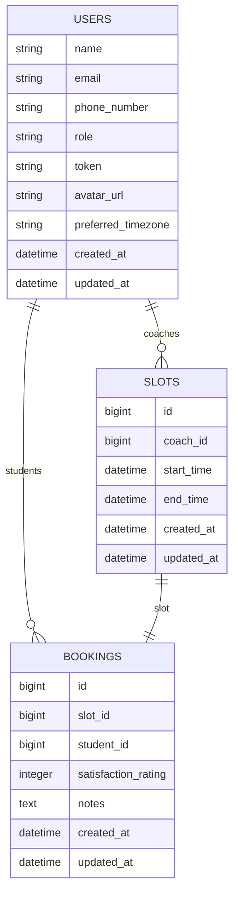

# CoachConnect

## Table of Contents

- [Testing the Live App](#testing-the-live-app)
- [Running the Project Locally](#running-the-project-locally)
  - [Backend - Rails API & Postgres DB](#backend---rails-api--postgres-db)
  - [Frontend](#frontend)
- [Coaching API Endpoints](#coaching-api-endpoints)
  - [Simple Token-Based Authentication](#simple-token-based-authentication)
  - [Users](#users)
  - [Bookings](#bookings)
  - [Slots](#slots)
- [Error Responses](#error-responses)
- [Database Schema](#database-schema)
- [Built With](#built-with)

---

## Testing the Live App

You can test the live site the following URL:

[https://coach-connect-frontend.onrender.com/](https://coach-connect-frontend.onrender.com/)

## Running the Project Locally

### Backend - Rails API & Postgres DB

1. **Install Docker**  
   Make sure [Docker](https://docs.docker.com/engine/install/) is installed on your system.

2. **Create a `.env` File**  
   Create a `.env` file in the root directory based on the `.env.template` file. Below is an example configuration:

   ```env
   DBHOST=localhost
   DBUSER=postgres
   DBPASS=insert_your_password_here

   POSTGRES_DB=coaching-api-development
   POSTGRES_USER=postgres
   POSTGRES_PASSWORD=insert_your_password_here

   PGADMIN_DEFAULT_EMAIL=admin@example.com
   PGADMIN_DEFAULT_PASSWORD=insert_your_password_here

   API_DBHOST=coaching-db
   API_DBUSER=postgres
   API_DBPASS=insert_your_password_here

   coaching-api_DATABASE_PASSWORD=insert_your_password_here
   ```

3. **Build and Start the Containers**  
   Run the following commands to assemble the containers and start the services:

   ```bash
   docker compose build
   docker compose up
   ```

4. **Set Up the Database**  
   Once the containers are running, set up the database by executing the following commands:

   ```bash
   docker compose exec coaching-api bash
   rails db:create
   rails db:migrate
   rails db:seed
   ```

---

### Frontend

1. **Install pnpm**  
   Install [pnpm](https://pnpm.io/installation) if it is not already installed.

2. **Install Dependencies**  
   Navigate to the `frontend` directory and install the required dependencies:

   ```bash
   pnpm install
   ```

3. **Run the Frontend**  
   Start the frontend development server:

   ```bash
   pnpm run dev
   ```

4. **Access the Frontend**  
   Open your browser and navigate to `http://localhost:5173/`.

---

## Coaching API Endpoints

### Simple Token-Based Authentication

All endpoints require a `Bearer` token in the `Authorization` header for authentication (except for user index, show, and create).

**Header Example**:

```
Authorization: Bearer <user_token>
```

If the token is invalid or missing, the API will return:

```json
{
  "error": "Unauthorized user"
}
```

---

## Users

### 1. **Get All Users**

**Endpoint**: `GET /users`

**Query Parameters**:

- `role` (optional): Filter by user role (`coach` or `student`).
- `available` (optional): Filter coaches with available slots (`true` or `false`).
- `stats` (optional): Include additional stats like sessions completed and average rating (`true` or `false`).

**Response**:

```json
[
  {
    "id": 1,
    "name": "Coach Casey",
    "phone_number": "+123456789",
    "avatar_url": "https://example.com/avatar.jpg",
    "token": "user_token",
    "preferred_timezone": "America/New_York",
    "role": "coach",
    "created_at": "2025-04-15T12:00:00Z",
    "updated_at": "2025-04-15T12:00:00Z",
    "sessions_completed": 10,
    "average_rating": 4.5,
    "soonest_available_slot": {
      "start_time": "2025-04-16T10:00:00Z",
      "end_time": "2025-04-16T11:00:00Z"
    }
  }
]
```

---

### 2. **Get a Single User**

**Endpoint**: `GET /users/:id`

**Response**:

```json
{
  "id": 1,
  "name": "Coach Casey",
  "phone_number": "+123456789",
  "avatar_url": "https://example.com/avatar.jpg",
  "preferred_timezone": "America/New_York",
  "role": "coach",
  "created_at": "2025-04-15T12:00:00Z",
  "updated_at": "2025-04-15T12:00:00Z"
}
```

---

### Create User

**Endpoint**: `POST /users`

**Request Body**:

```json
{
  "user": {
    "name": "Updated Name",
    "phone_number": "+987654321",
    "preferred_timezone": "Europe/London"
  }
}
```

---

### 3. **Update User**

**Endpoint**: `PATCH /users/:id`

**Request Body**:

```json
{
  "user": {
    "name": "Updated Name",
    "phone_number": "+987654321",
    "preferred_timezone": "Europe/London"
  }
}
```

---

## Bookings

### 1. **Get a Booking**

**Endpoint**: `GET /bookings/:id`

**Response**:

```json
{
  "id": 1,
  "slot_id": 1,
  "student_id": 2,
  "satisfaction_rating": 5,
  "notes": "Great session!",
  "created_at": "2025-04-15T12:00:00Z",
  "updated_at": "2025-04-15T12:30:00Z"
}
```

---

### 2. **Create a Booking**

**Endpoint**: `POST /bookings`

**Description**: Creates a new booking. Only students can create bookings.

**Request Body**:

```json
{
  "booking": {
    "slot_id": 1,
    "notes": "Looking forward to this session!"
  }
}
```

---

### 3. **Update a Booking**

**Endpoint**: `PATCH /bookings/:id`

**Description**: Updates a booking. Students can update the `satisfaction_rating`, and coaches can update the `notes`.

**Request Body**:

```json
{
  "booking": {
    "satisfaction_rating": 5,
    "notes": "Updated notes"
  }
}
```

---

## Slots

### 1. **Get a Slot**

**Endpoint**: `GET /slots/:id`

**Description**: Retrieves details of a specific slot. Only accessible by the assigned coach.

**Response**:

```json
{
  "id": 1,
  "start_time": "2025-04-16T10:00:00Z",
  "end_time": "2025-04-16T11:00:00Z",
  "booking": {
    "id": 1,
    "student_id": 2,
    "student_name": "Student Sam",
    "student_phone": "+123456789",
    "avatar_url": "https://example.com/avatar.jpg",
    "satisfaction_rating": 5,
    "notes": "Great session!"
  }
}
```

---

## Error Responses

- **401 Unauthorized**:

  ```json
  {
    "error": "Unauthorized user"
  }
  ```

- **403 Forbidden**:

  ```json
  {
    "error": "Not authorized to perform this action"
  }
  ```

- **404 Not Found**:

  ```json
  {
    "error": "Record not found"
  }
  ```

---

## Database Schema



1. **Users and Slots**:

   - A `user` with the role of `coach` can have multiple `slots`.
   - The `coach_id` in the `slots` table references the `id` in the `users` table.

2. **Users and Bookings**:

   - A `user` with the role of `student` can have multiple `bookings`.
   - The `student_id` in the `bookings` table references the `id` in the `users` table.

3. **Slots and Bookings**:
   - Each `slot` can have at most one `booking`.
   - The `slot_id` in the `bookings` table references the `id` in the `slots` table.

---

## Built With

#### Backend:

- [Ruby on Rails](https://rubyonrails.org/)
- [PostgreSQL](https://www.postgresql.org/)
- [Docker](https://www.docker.com/)

#### Frontend:

- [React](https://react.dev/)
- [TypeScript](https://www.typescriptlang.org/)
- [Tailwind CSS](https://tailwindcss.com/)
- [Vite](https://vitejs.dev/)
- [Prime React](https://primereact.org/)
- [date-fns](https://date-fns.org/)
- [React Schedule Meeting](https://react-schedule-meeting.netlify.app/)
- [React Hot Toast](https://react-hot-toast.com/)
